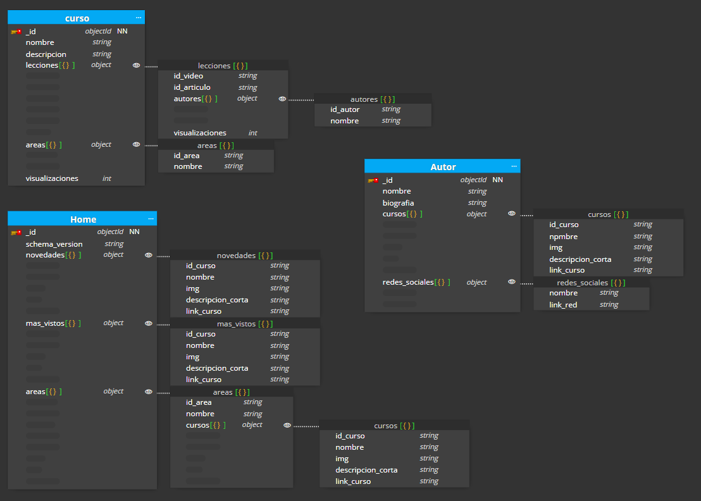
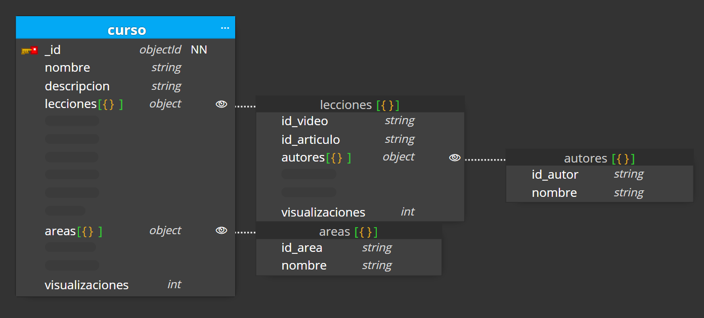
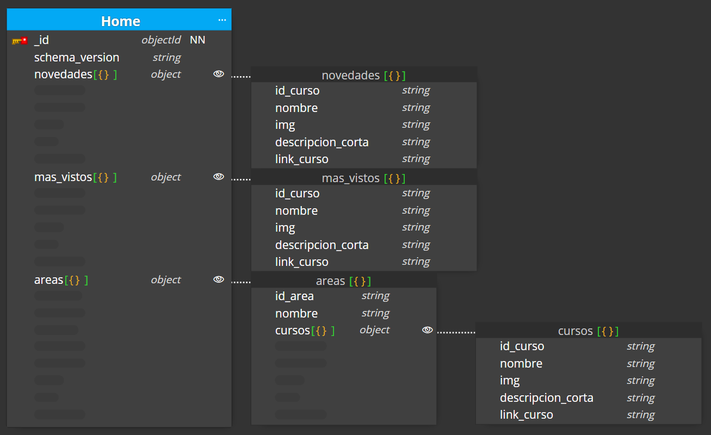

# 00-entrega-modelado

## Caso obligatorio

__________________________________________

- Aplicado Patron Extended Ref en Cursos, embebiendo las lecciones dentro de estes, debido a que esta informacion rara vez se va a modificar y tedrá muchas lecturas.De esta forma mejoramos el rendimiento de las consultas que recuperan un curso junto con sus lecciones, ya que toda la información necesaria estará contenida en una sola coleccion, evitando la necesidad de realizar múltiples operaciones de base de datos para obtener los datos relacionados.

__________________________________________

- Aplcado Subset Pattern para incluir informacion basica sobre los autores de cada leccion en el documento de esta.

__________________________________________

- Aplcado Subset Pattern en Home, embebiendo informacion basica de los cursos mas destacados para el usuario de forma personalizada. De este modo evitamos joins innecesarios ya que rara vez se cambia informacion en un curso. Tamien aplicamos subset pattern, embebiendo solamente 5 cursos, de este modo ahorramos en memoria y tamano de coleccion.

