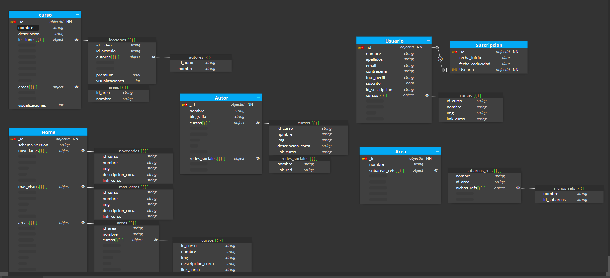
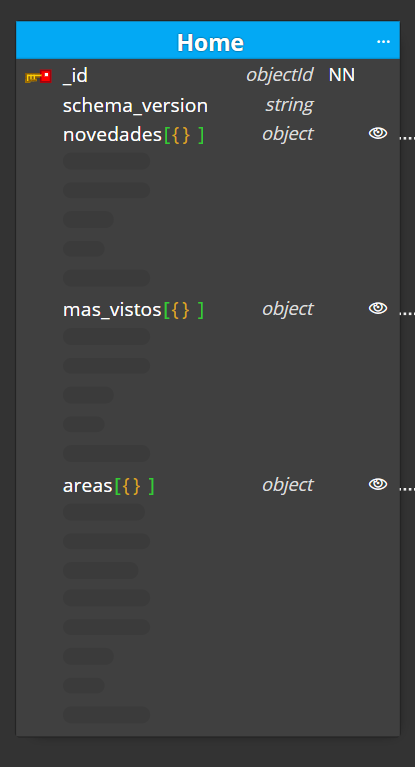

# 00-entrega-modelado

## Caso opcional

__________________________________________

- Aplicado Computed Pattern al numero de visualizaciones totales de cursos y lecciones. debido a que es una informacion que se lee a menudo, creamos un campo que muestre el total y se actualice cada 24 horas. De este modo ahorramos cicles de CPU

___________________________________________

- Aplicado Schema Versioning en el Home ya que es una coleccion susceptible a cambiar en el futuro.

___________________________________________

- Aplicado tree pattern combinado a la coleccion "area", "subarea" y "nicho" referenciandolos por parent reference y child reference.

